> **Incident** **Investigation** **Report**

**Case** **Title:** RMM-Assisted RansomHub Deployment Following RDP
Password Spray **Analyst:** Kennedy Aikohi

**Environment:** INFYActive Directory Domain **Timeframe:** 19 October
2025 to 21 October 2025

**Primary** **Impact:** Domain-wide ransomware deployment with confirmed
data exfiltration

**Executive** **Summary**

This investigation documents a financially motivated ransomware
intrusion that progressed through a complete attack lifecycle, beginning
with an external RDP password spray and culminating in domain-wide
ransomware execution associated with RansomHub tradecraft.

The threat actor gained initial access by abusing weak password hygiene
on a publicly exposed RDP service. Multiple domain user accounts were
compromised without triggering lockout controls. One account was then
selected for sustained interactive access and lateral movement.

Following initial access, the attacker performed internal reconnaissance
using third-party network scanning utilities, validated SMB write
permissions, accessed sensitive internal documentation, harvested stored
credentials, and established persistent command and control through
abused legitimate remote monitoring and management software.

Data was staged and exfiltrated using Rclone over SFTP prior to
ransomware deployment. The ransomware payload was distributed via the
established RMM channel and propagated laterally over SMB, resulting in
widespread encryption across the domain.

Analysis was conducted using Splunk, Sysmon telemetry, disk forensic
artifacts, Detect It Easy, and VirusTotal intelligence.

**Environment** **Overview**

The affected environment consisted of a Windows Active Directory domain
with multiple user workstations, file servers, and a backup server.
External RDP access was enabled on at least one public-facing system
without multifactor authentication. Centralized logging was available
through Splunk, including Windows Security and Sysmon event data.

**Attack** **Timeline** **Overview**

> **Phase** **Date** **and** **Time** **UTC** **Activity**
>
> InitialAccess
>
> CredentialAbuse

19 Oct 2025

20 Oct 2025

External RDP password spray

Multi-account compromise

> Lateral Movement 20 Oct 2025 RDP and SMB access
>
> Persistence
>
> Defense Evasion

20 Oct 2025

20 Oct 2025

RMM installation

Hidden VBScript execution

> **Phase** **Date** **and** **Time** **UTC**
> **Activity**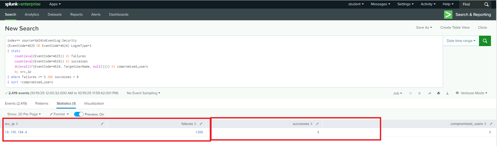 style="width:6.69305in;height:1.97083in" />
>
> Exfiltration
>
> Impact

20 Oct 2025

21 Oct 2025

Rclone over SFTP

Ransomware deployment

**Investigation** **Findings**

> **External** **RDP** **Password** **Spray**

**MITRE** **ATT&CK:** T1110.003 Brute Force Password Spraying, T1078
ValidAccounts

Windows Security logs revealed a high volume of failed RDP
authentication attempts targeting multiple domain user accounts from the
external IP address **18.195.184.4**. Shortly after the failures,
successful logons were observed for several accounts originating from
the same source.

The lack of account lockouts and the distribution of attempts across
users is consistent with a password spray attack rather than traditional
brute force activity.

> **Scope** **of** **Account** **Compromise**

**MITRE** **ATT&CK:** T1078 ValidAccounts

Correlation across authentication logs confirmed that **six**
**distinct** **domain** **user** **accounts** were successfully
compromised during the password spray window. This demonstrated that the
attacker obtained broad access without triggering defensive controls.

**Primary** **Account** **Used** **for** **Lateral** **Movement**

**MITRE** **ATT&CK:** T1078 ValidAccounts, T1021.001 Remote Services RDP

The account **INFY\tfox** was repeatedly observed authenticating to
multiple systems and executing post-compromise tooling. This account
became the attacker’s primary operational identity for discovery,
credential access, and execution.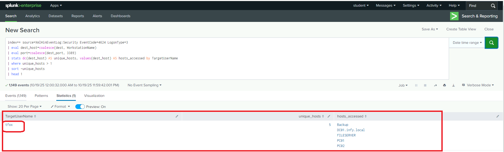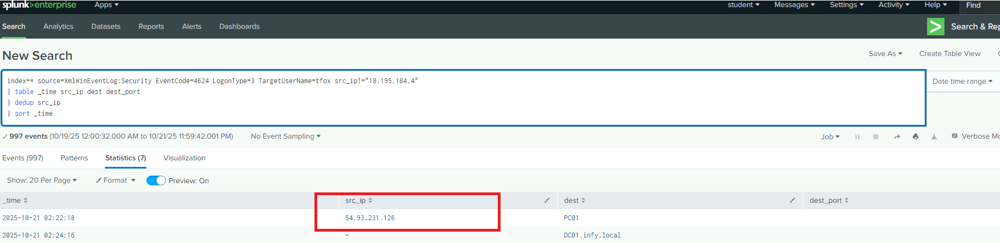

> **Secondary** **RDP** **Infrastructure**

**MITRE** **ATT&CK:** T1021.001 Remote Services RDP, T1090 Proxy

After establishing access, the attacker rotated infrastructure and
initiated RDP sessions from a second external IP address
**54.93.231.126**. This behavior indicates operational security measures
to reduce detection and maintain access continuity.

> **Internal** **Network** **Discovery** **Using** **Advanced** **IP**
> **Scanner**

**MITRE** **ATT&CK:** T1018 Remote System Discovery, T1046 Network
Service Discovery

Sysmon process creation events confirmed execution of
**advanced_ip_scanner.exe** under the compromised account. VirusTotal
analysis flagged the tool as malicious due to its association with
post-exploitation activity and known attacker tradecraft.

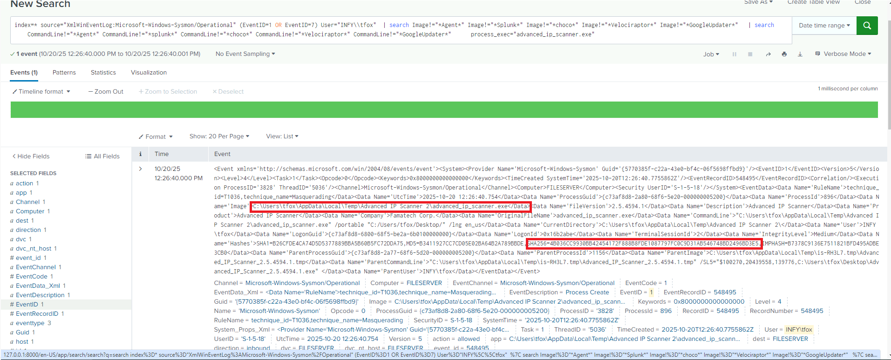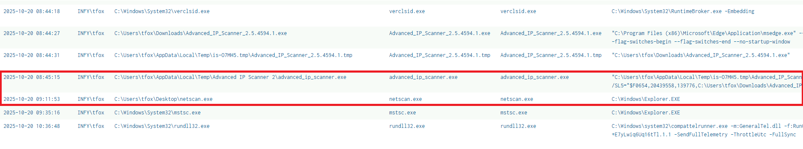

> **Secondary** **Discovery** **Using** **Netscan**

**MITRE** **ATT&CK:** T1046 Network Service Discovery

Asecond reconnaissance utility, **Netscan**, was executed to perform
targeted service and port enumeration.Analysis confirmed seven ports
were scanned on workstation PC01, indicating focused reconnaissance
following initial discovery.

> **SMB** **Write** **Access** **Validation**

**MITRE** **ATT&CK:** T1135 Network Share Discovery

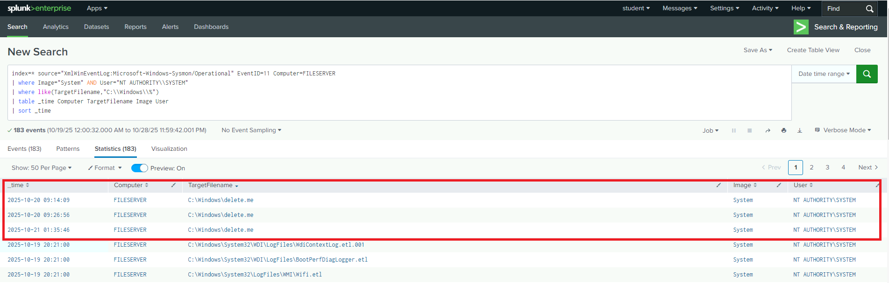The creation of a file named
**delete.me** on multiple SMB shares confirmed that the attacker
validated write permissions prior to lateral movement or malware
deployment.

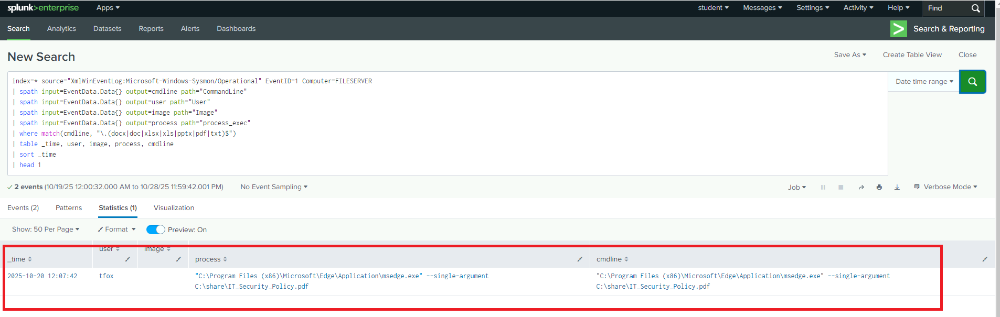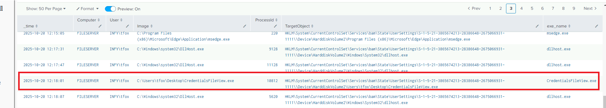

> **Access** **to** **Sensitive** **Internal** **Documentation**

**MITRE** **ATT&CK:** T1005 Data from Local System, T1083 File and
Directory Discovery

File access logs confirmed the first sensitive document accessed on the
file server was **IT_Security_Policy.pdf**. The nature of this document
suggests the attacker reviewed internal security controls and response
procedures.

> **Credential** **Harvesting** **Activity**

**MITRE** **ATT&CK:** T1555 Credentials from Password Stores

Sysmon telemetry confirmed execution of **CredentialsFileView**, a
utility designed to extract stored Windows credentials.Associated
registry access further supports credential harvesting behavior.

> **Persistent** **Command** **and** **Control** **via** **RMM**

**MITRE** **ATT&CK:** T1219 Remote Access Software, T1547 Boot or Logon
Autostart Execution

Service installation logs confirmed deployment of **AteraAgent.exe** and
**SRService.exe**. These legitimate RMM tools were installed without
authorization and configured to persist across reboots, providing
long-term command and control.

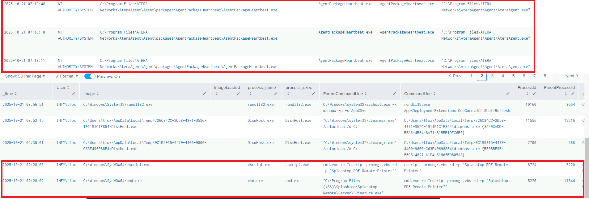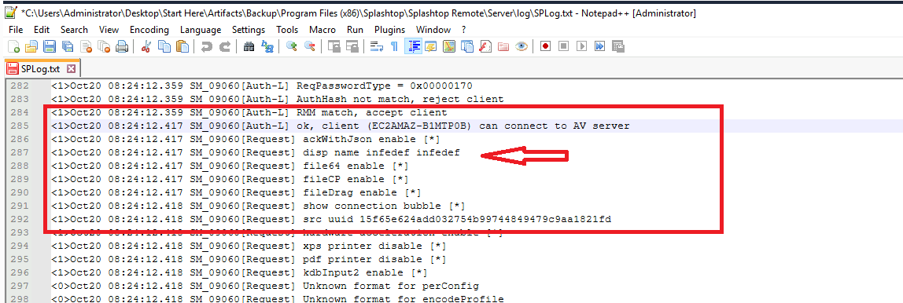

> **RMM** **Session** **Configuration** **and** **Operator** **Host**

**MITRE** **ATT&CK:** T1219 Remote Access Software

RMM logs showed the attacker configured the session display name as
**infedef**. The connecting host was identified as **EC2AMAZ-B1MTP0B**,
indicating use of cloud-hosted attacker infrastructure.

**Stealth** **Execution** **via** **VBScript**

**MITRE** **ATT&CK:** T1059.005 Visual Basic, T1564.003 Hidden Window

Repeated executions of **nocmd.vbs** via wscript.exe were observed from
*C:* *\ProgramData\Veeam*. This script suppressed visible command
windows, allowing silent execution of attacker hookup commands.

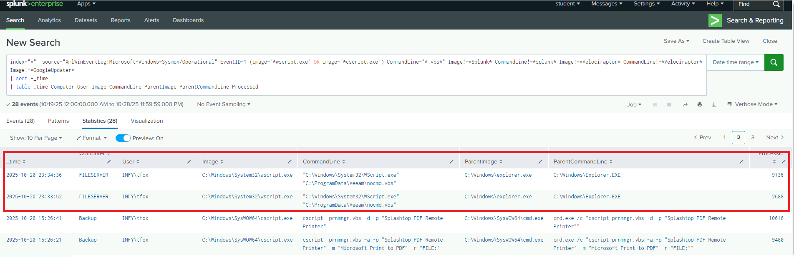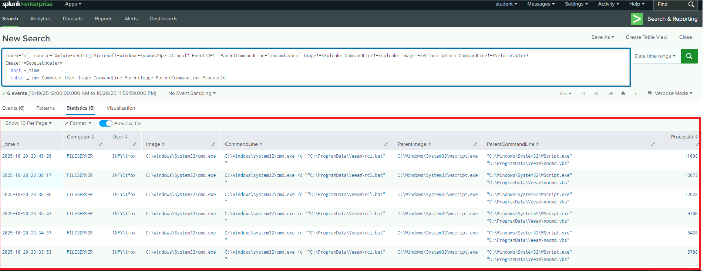

> **Batch** **Script** **Wrapper** **for** **Exfiltration**

**MITRE** **ATT&CK:** T1059.003 Windows Command Shell

Process lineage analysis confirmed that nocmd.vbs executed **rcl.bat**,
which contained the logic for launching the exfiltration utility.

> **Data** **Exfiltration** **Using** **Rclone**

**MITRE** **ATT&CK:** T1567.002 Exfiltration to Cloud Storage

Network telemetry confirmed **rclone.exe** transferred data to
**18.185.121.245** using the **SFTP** protocol over TCP 443. Sustained
outbound connections indicate successful data exfiltration prior to
ransomware execution.

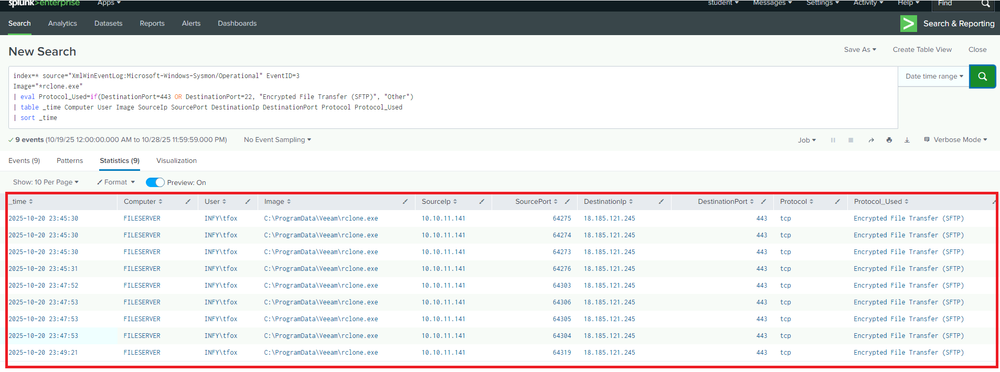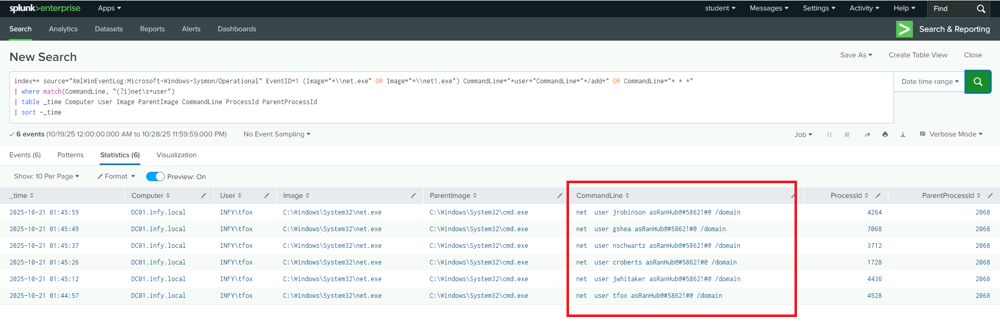

> **Domain** **Account** **Password** **Manipulation**

**MITRE** **ATT&CK:** T1098 Account Manipulation

The attacker reset multiple domain user passwords using repeated net
user /domain commands.All affected accounts were assigned the same
password **asRanHub@#5862!** **\#@**, indicating deliberate persistence
and control consolidation.

> **Impact** **Analysis**

**Ransomware** **Deployment** **via** **RMM**

**MITRE** **ATT&CK:** T1486 Data Encrypted for Impact

The ransomware payload **amd64.exe** was dropped to *C:\ProgramData* and
executed across multiple systems using the established RMM channel.
Detect It Easy analysis confirmed encryption-related functionality.

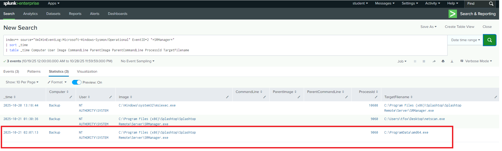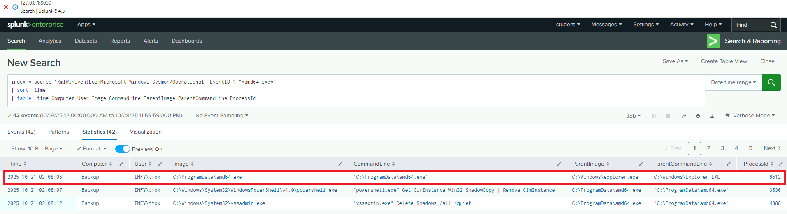

> **First** **Ransomware** **Execution**

The earliest confirmed execution of the ransomware occurred at **21**
**October** **2025** **02:08** **UTC**.

> **SMB-Based** **Propagation** **on** **File** **Server**

**MITRE** **ATT&CK:** T1021.002 SMB Windows Admin Shares

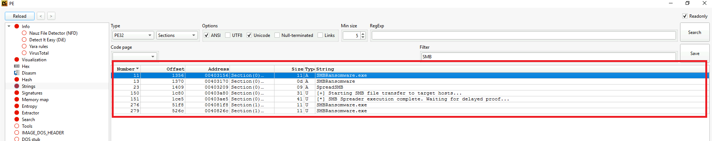On the file server, the
ransomware executed as **LQBEvT.exe**, with the original filename
identified as **SMBRansomware.exe**. This confirms host-specific
renaming and SMB-based propagation behavior.

**Conclusion**

This incident represents a mature, hands-on-keyboard ransomware
intrusion leveraging legitimate tools to evade detection. The attacker
demonstrated patience, operational security, and familiarity with
enterprise environments. Data exfiltration prior to encryption
significantly increased organizational risk and potential regulatory
exposure.

The intrusion aligns closely with known RansomHub tradecraft and
operational patterns observed in recent real-world ransomware campaigns.

**Recommendations**

> Implement multifactor authentication for all external RDP access
>
> Enforce account lockout and password spray detection policies
>
> Restrict and monitor RMM software installation and service creation
>
> Disable Windows Script Host where not operationally required
>
> Monitor for Rclone usage and unauthorized outbound SFTP traffic
>
> Apply least-privilege principles and credential hygiene controls
>
> Deploy behavior-based ransomware detection across endpoints
